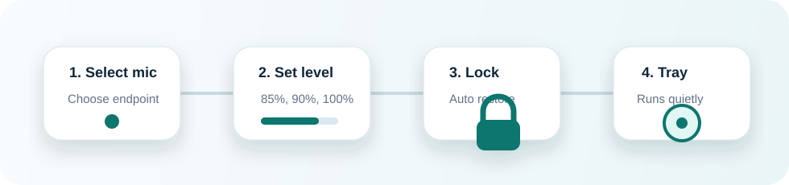

<p align="center">
  <a href="README.md">English version</a>
</p>

<p align="center">
  
</p>

# Mic Volume Lock

**Mic Volume Lock** — бесплатная open-source утилита для Windows, которая удерживает выбранную громкость микрофона на заданном уровне.

Если Windows, Discord, Zoom, игра, драйвер или фирменная аудио-утилита постоянно снижает громкость микрофона, Mic Volume Lock отслеживает выбранное устройство записи и автоматически возвращает нужный уровень.

Проект распространяется под **MIT License** и сделан для людей, которым просто надоело каждый час вручную возвращать громкость микрофона обратно.

<p align="center">
  
</p>

## Зачем нужна эта программа

На некоторых системах Windows 10/11 громкость микрофона может самопроизвольно уменьшаться после обновлений драйверов, изменений в приложениях связи, включённых аудио-улучшений или работы фирменных утилит NVIDIA/AMD/Realtek/USB-гарнитур.

Mic Volume Lock решает практическую часть проблемы:

- выбираете микрофон;
- задаёте нужную громкость;
- включаете фиксацию;
- оставляете программу работать в трее.

## Основные возможности

- **Фиксация громкости микрофона** через Windows Core Audio endpoint volume.
- **Выбор устройства** и поддержка микрофона связи по умолчанию.
- **Работа в трее**, чтобы программа не мешала на рабочем столе.
- **Автозапуск вместе с Windows**.
- **Светлая и тёмная тема** с переключением прямо в интерфейсе.
- **Профили громкости**: игры, работа, стрим, тихая комната и свои варианты.
- **Глобальные горячие клавиши** для включения защиты и быстрого изменения уровня.
- **Исключения процессов и подсказки**, включая Discord, Zoom, Steam/игры, настройки Windows, NVIDIA Broadcast / RTX Voice и AMD Noise Suppression.
- **Экспорт логов для поддержки**, если нужно быстро понять, что происходит на системе пользователя.
- **Многоязычный интерфейс**: English, Русский, Spanish, Portuguese Brazil, German, French, Italian, Polish, Turkish, Chinese Simplified, Japanese, Korean, Dutch, Indonesian, Vietnamese, Czech, Arabic, Hindi, Romanian.
- **Классический Windows installer** через Inno Setup.

## Скачать

Готовые сборки будут публиковаться в GitHub Releases:

[Скачать Mic Volume Lock](https://github.com/DokPlay/Mic-Volume-Lock/releases)

Файлы вроде `MicVolumeLockSetup.exe` и portable-сборок прикрепляются к релизам отдельно. В сам репозиторий они специально не добавляются.

## Быстрый старт

1. Скачайте `MicVolumeLockSetup.exe` со страницы Releases.
2. Запустите установщик.
3. Выберите язык установки.
4. Откройте Mic Volume Lock.
5. Перейдите во вкладку **Микрофон**.
6. Выберите нужный микрофон.
7. Установите целевую громкость, например `85%` или `100%`.
8. Включите **Фиксировать уровень**.
9. Оставьте программу работать в трее.

Если громкость изменится во время включённой фиксации, Mic Volume Lock автоматически вернёт её к заданному уровню.

## Рекомендуемая настройка

Для стабильной работы лучше сразу:

1. Включить **Запускать Mic Volume Lock вместе с Windows**.
2. Включить **Следовать за устройством связи по умолчанию**, если вы часто переподключаете гарнитуру или USB-микрофон.
3. Оставить уведомления включёнными на первое время, а потом отключить, если они не нужны.
4. Проверить вкладку **Исключения**, если громкость всё равно часто меняется.

## Исключения: кто может менять громкость

Windows не всегда сообщает, какое именно приложение изменило уровень микрофона. Поэтому Mic Volume Lock показывает практичные подсказки по самым частым источникам проблемы и даёт временное исключение: восстановление громкости можно отключить, пока выбранный процесс запущен.

- **Discord**: Voice & Video -> Automatic Gain Control.
- **Zoom**: Audio -> Automatically adjust microphone volume.
- **Steam / игры**: настройки голосового ввода и усиления микрофона.
- **Windows**: параметры связи и эксклюзивный режим микрофона.
- **NVIDIA Broadcast / RTX Voice**: эффекты микрофона и шумоподавление.
- **AMD Software: Adrenalin Edition**: AMD Noise Suppression и AMD Streaming Audio Device.

## Что программа не делает

Mic Volume Lock **не записывает звук с микрофона**.

Программа не хранит, не анализирует, не загружает и не передаёт ваш голос. Она только читает и меняет системный уровень Windows endpoint volume для выбранного устройства записи.

Некоторые драйверы, vendor APO, аппаратный AGC и exclusive-mode аудиопути могут влиять на реальное усиление микрофона вне обычного системного ползунка. Mic Volume Lock работает на уровне endpoint volume и даёт исключения/подсказки для остальных случаев.

## Сборка из исходников

Требования:

- Windows 10 или Windows 11.
- .NET 8 SDK.
- Inno Setup 6, если нужно собрать установщик.

Собрать приложение:

```powershell
cd "C:\Mic Volume Lock"
dotnet build -c Release
```

Создать standalone exe:

```powershell
.\build-release.ps1
```

Результат:

```text
publish\MicVolumeLock.exe
```

Собрать установщик:

```powershell
.\build-installer.ps1
```

Результат:

```text
dist\MicVolumeLockSetup.exe
```

Если Inno Setup 6 не установлен:

```powershell
winget install --id JRSoftware.InnoSetup -e
```

## Что не попадает в репозиторий

В репозитории должны лежать исходники, скрипты сборки, ассеты, документация и файл установщика Inno Setup.

Не нужно коммитить:

- собранные `.exe` файлы;
- папку `publish/`;
- папку `dist/`;
- папки `bin/` и `obj/`;
- логи и локальные настройки;
- ключи подписи, сертификаты, `.pfx`, `.pem`, `.key`, `.jks` и любые секреты.

Готовые бинарные файлы должны быть во вкладке GitHub Releases, а не внутри исходного кода.

## Статус проекта

Mic Volume Lock — ранняя публичная утилита. Ошибки, предложения, логи и идеи приветствуются.

Если программа помогла, лучший способ поддержать проект сейчас — поставить звезду на GitHub и поделиться ссылкой с теми, у кого такая же проблема с микрофоном.

## Лицензия

MIT License. См. [LICENSE](LICENSE).
